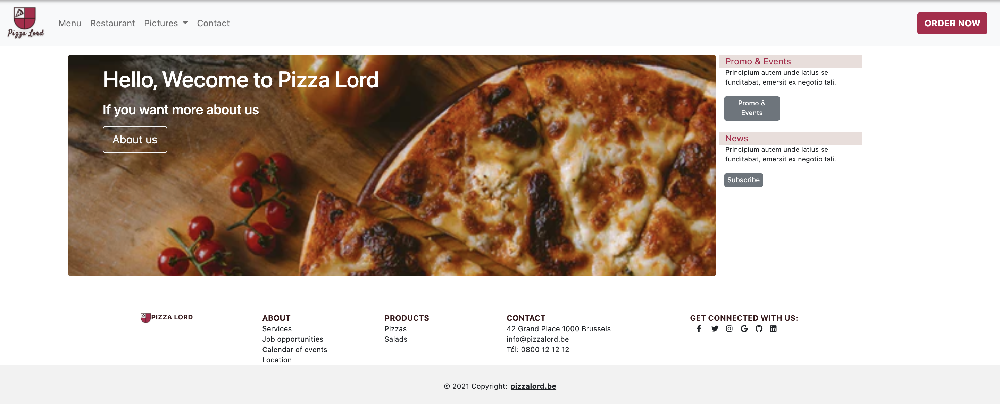
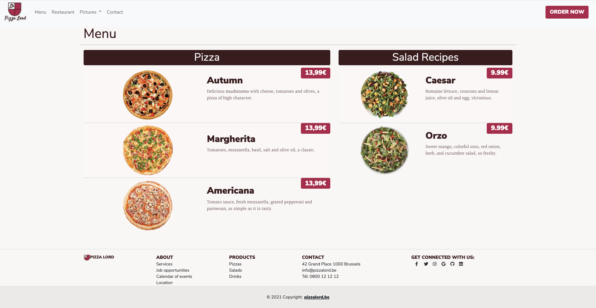
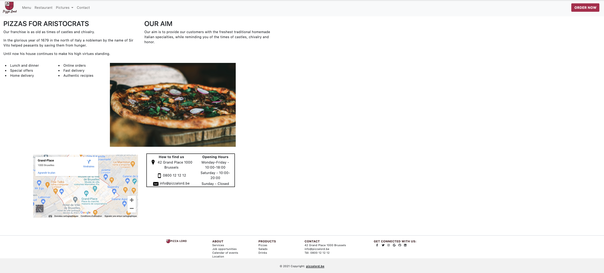
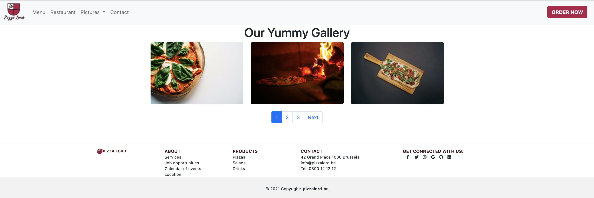
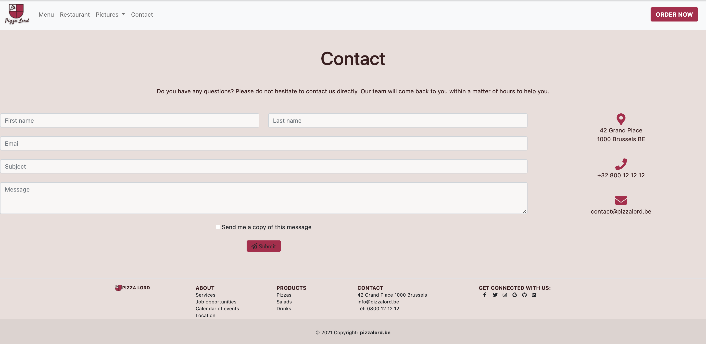

# Welcome to Pizza Lord !

## Bootsrap Project
Window web site for a Pizzeria.  
Created in mid-june 2021 during the first month of our web-developer training at BeCode.org.

[**Instructions**](https://github.com/becodeorg/CRL-Keller-3.31/blob/master/LearningPath/01.The-Field/07.Bootstrap/restaurant.md)

## Team Members
* [Elsa Magalhães](https://github.com/Magael) | @Magael 
* [Abdelilah Benghadda](https://github.com/abb-becode) | @abb-becode
* [Rayane Lamri](https://github.com/RayaneLamri) | @RayaneLamri
* [Maxime Jacques](https://github.com/maxjacques) | @maxjacques

## Languages & Frameworks
* Bootstrap
* HTML
* CSS 
* SASS
* JavaScript (a little)

## Images banks
*royality-free* ✅ 

* [Unsplash](https://unsplash.com/)
* [Free Icons](https://www.freeiconspng.com)
* [PNG Item](https://www.pngitem.com)

## Responsive ?
Yes it is 📱

## Changelog
### v.1.0.0
* [Inital release](https://abb-becode.github.io/restaurant-css-framework/index.html)

## Screenshots 

